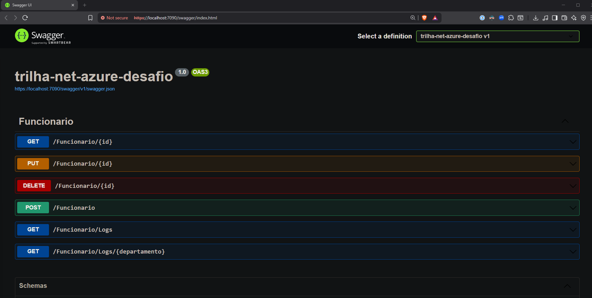
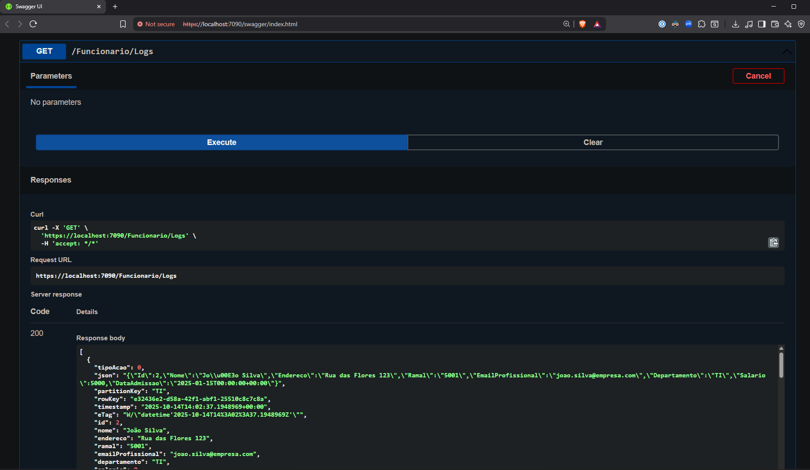

# DIO - Trilha .NET - Nuvem com Microsoft Azure
www.dio.me

## Desafio de projeto
Para este desafio, você precisará usar seus conhecimentos adquiridos no módulo de Nuvem com Microsoft Azure, da trilha .NET da DIO.

## Contexto
Você precisa construir um sistema de RH, onde para essa versão inicial do sistema o usuário poderá cadastrar os funcionários de uma empresa. 

Essa cadastro precisa precisa ter um CRUD, ou seja, deverá permitir obter os registros, criar, salvar e deletar esses registros. A sua aplicação também precisa armazenar logs de toda e qualquer alteração que venha a ocorrer com um funcionário.

## Premissas
A sua aplicação deverá ser do tipo Web API, Azure Functions ou MVC, fique a vontade para implementar a solução que achar mais adequado.

A sua aplicação deverá ser implantada no Microsoft Azure, utilizando o App Service para a API, SQL Database para o banco relacional e Azure Table para armazenar os logs.

A sua aplicação deverá armazenar os logs de todas as alterações que venha a acontecer com o funcionário. Os logs deverão serem armazenados em uma Azure Table.

A sua classe principal, a classe Funcionario e a FuncionarioLog, deve ser a seguinte:


A classe FuncionarioLog é filha da classe Funcionario, pois o log terá as mesmas informações da Funcionario.

Não se esqueça de gerar a sua migration para atualização no banco de dados.

## Métodos esperados
É esperado que você crie o seus métodos conforme a seguir:


**Swagger**


**Endpoints**


| Verbo  | Endpoint                | Parâmetro | Body               |
|--------|-------------------------|-----------|--------------------|
| GET    | /Funcionario/{id}       | id        | N/A                |
| PUT    | /Funcionario/{id}       | id        | Schema Funcionario |
| DELETE | /Funcionario/{id}       | id        | N/A                |
| POST   | /Funcionario            | N/A       | Schema Funcionario |

Esse é o schema (model) de Funcionario, utilizado para passar para os métodos que exigirem:

```json
{
  "nome": "Nome funcionario",
  "endereco": "Rua 1234",
  "ramal": "1234",
  "emailProfissional": "email@email.com",
  "departamento": "TI",
  "salario": 1000,
  "dataAdmissao": "2022-06-23T02:58:36.345Z"
}
```

## Ambiente
Este é um diagrama do ambiente que deverá ser montado no Microsoft Azure, utilizando o App Service para a API, SQL Database para o banco relacional e Azure Table para armazenar os logs.


## Solução

✅ **Implementação Completa!**

Todos os requisitos do desafio foram implementados com sucesso:

### Funcionalidades Implementadas

- ✅ **CRUD Completo**: GET, POST, PUT, DELETE para funcionários
- ✅ **Integração SQL Server**: Entity Framework Core 8.0.18 com SQL Server Express
- ✅ **Logs de Auditoria**: Todas as operações (Create, Update, Delete) são registradas no Azure Table Storage
- ✅ **Validações**: Campos obrigatórios (Nome, Departamento) e prevenção de duplicação de IDs
- ✅ **Endpoints de Consulta de Logs**:
  - `GET /Funcionario/Logs` - Todos os logs
  - `GET /Funcionario/Logs/{departamento}` - Logs por departamento
- ✅ **Documentação Swagger**: Interface interativa para testar a API
- ✅ **Migrations Aplicadas**: Banco de dados RHDatabase criado com tabela Funcionarios

### Tecnologias Utilizadas

- **.NET 8** - Framework atualizado
- **Entity Framework Core 8.0.18** - ORM para SQL Server
- **Azure Table Storage** - Armazenamento de logs de auditoria
- **Azurite** - Emulador local do Azure Storage
- **SQL Server Express** - Banco de dados relacional
- **Swagger/OpenAPI** - Documentação interativa da API

### Configuração Local

**1. Pré-requisitos:**
- .NET 8 SDK instalado
- SQL Server Express instalado e rodando
- Node.js e npm (para Azurite)

**2. Iniciar Azurite (emulador do Azure Storage):**
```bash
npm install -g azurite
azurite --silent --location c:\azurite --debug c:\azurite\debug.log
```

**3. Aplicar Migrations:**
```bash
dotnet ef database update
```

**4. Executar a API:**
```bash
dotnet run
```

**5. Acessar Swagger:**
- URL: `https://localhost:7090/swagger`

### Estrutura de Logs

Cada operação (CREATE, UPDATE, DELETE) gera um log no Azure Table Storage com:

- **TipoAcao**: 0 = Inclusão, 1 = Atualização, 2 = Remoção
- **PartitionKey**: Departamento do funcionário (para queries eficientes)
- **RowKey**: GUID único para cada operação
- **JSON**: Snapshot completo dos dados do funcionário no momento da operação
- **Timestamp**: Data e hora da operação

### Validações Implementadas

**POST /Funcionario:**
- Nome é obrigatório
- Departamento é obrigatório
- ID é gerado automaticamente pelo banco (qualquer ID fornecido é ignorado)

**PUT /Funcionario/{id}:**
- Nome é obrigatório
- Departamento é obrigatório
- Funcionário deve existir (retorna 404 se não encontrado)

**DELETE /Funcionario/{id}:**
- Funcionário deve existir (retorna 404 se não encontrado)

## Comprovação de Funcionamento

### API Funcionando

A API está completamente funcional com todos os endpoints implementados:



### Logs no Azure Table Storage

Todas as operações são registradas no Azure Table Storage com auditoria completa:



## Endpoints Disponíveis

| Verbo  | Endpoint                         | Descrição                              |
|--------|----------------------------------|----------------------------------------|
| GET    | /Funcionario/{id}                | Buscar funcionário por ID              |
| POST   | /Funcionario                     | Criar novo funcionário                 |
| PUT    | /Funcionario/{id}                | Atualizar funcionário existente        |
| DELETE | /Funcionario/{id}                | Deletar funcionário                    |
| GET    | /Funcionario/Logs                | Buscar todos os logs de auditoria      |
| GET    | /Funcionario/Logs/{departamento} | Buscar logs por departamento           |

## Exemplo de Uso

**Criar Funcionário:**
```bash
POST /Funcionario
{
  "nome": "João Silva",
  "endereco": "Rua das Flores 123",
  "ramal": "5001",
  "emailProfissional": "joao.silva @empresa.com",
  "departamento": "TI",
  "salario": 5000,
  "dataAdmissao": "2025-01-15T00:00:00Z"
}
```

**Consultar Logs do Departamento TI:**
```bash
GET /Funcionario/Logs/TI
```

## Deploy no Azure

### Recursos Criados

A aplicação está implantada no Azure com os seguintes recursos:

- **App Service**: `app-desafio-dio-etfvdmcbfmgfb2c6.canadacentral-01.azurewebsites.net`
- **SQL Server**: `maxh.database.windows.net`
- **SQL Database**: `dio-net-azure-desafio`
- **Storage Account**: `storageaccountdioazure`
- **Table Storage**: `FuncionarioLog`

### Acessar API em Produção

- **Swagger UI**: https://app-desafio-dio-etfvdmcbfmgfb2c6.canadacentral-01.azurewebsites.net/swagger
- **Test Connection**: https://app-desafio-dio-etfvdmcbfmgfb2c6.canadacentral-01.azurewebsites.net/Funcionario/TestConnection

### Configuração de Deployment

**IMPORTANTE:** Este projeto usa Azure App Service Configuration para armazenar connection strings de forma segura.

**Arquivos de Configuração:**
- `appsettings.json` - **Não contém secrets** (seguro para commit)
- `appsettings.Development.json` - Configuração local (SQL Express + Azurite)
- Azure App Service Configuration - Connection strings de produção (não versionadas)

**Por que `appsettings.json` está no .gitignore:**
- Previne commit acidental de secrets
- Azure App Service sobrescreve valores vazios com Environment Variables
- Segue best practices de segurança

### Troubleshooting Azure Deployment

Se você encontrar erro **HTTP 500** ao fazer deploy:

**Passo 1: Verificar Firewall do SQL Server**
1. Azure Portal → SQL Server `maxh` → Networking
2. Ativar: ✅ "Allow Azure services and resources to access this server"
3. Salvar

**Passo 2: Verificar Connection Strings**
1. Azure Portal → App Service → Configuration → Connection strings
2. Verificar que existem:
   - `ConexaoPadrao` (tipo: SQLAzure)
   - `SAConnectionString` (tipo: Custom)
   - `AzureTableName` (tipo: Custom) com valor `FuncionarioLog`

**Passo 3: Testar Conexões**
```bash
GET /Funcionario/TestConnection
```

Este endpoint retorna o status das conexões SQL e Table Storage.

**Guia Completo:**
Para instruções detalhadas de deployment e troubleshooting, consulte [AZURE_DEPLOYMENT.md](AZURE_DEPLOYMENT.md).

## Documentação Adicional

- **Arquitetura e Implementação**: [CLAUDE.md](CLAUDE.md)
- **Deploy e Troubleshooting Azure**: [AZURE_DEPLOYMENT.md](AZURE_DEPLOYMENT.md)